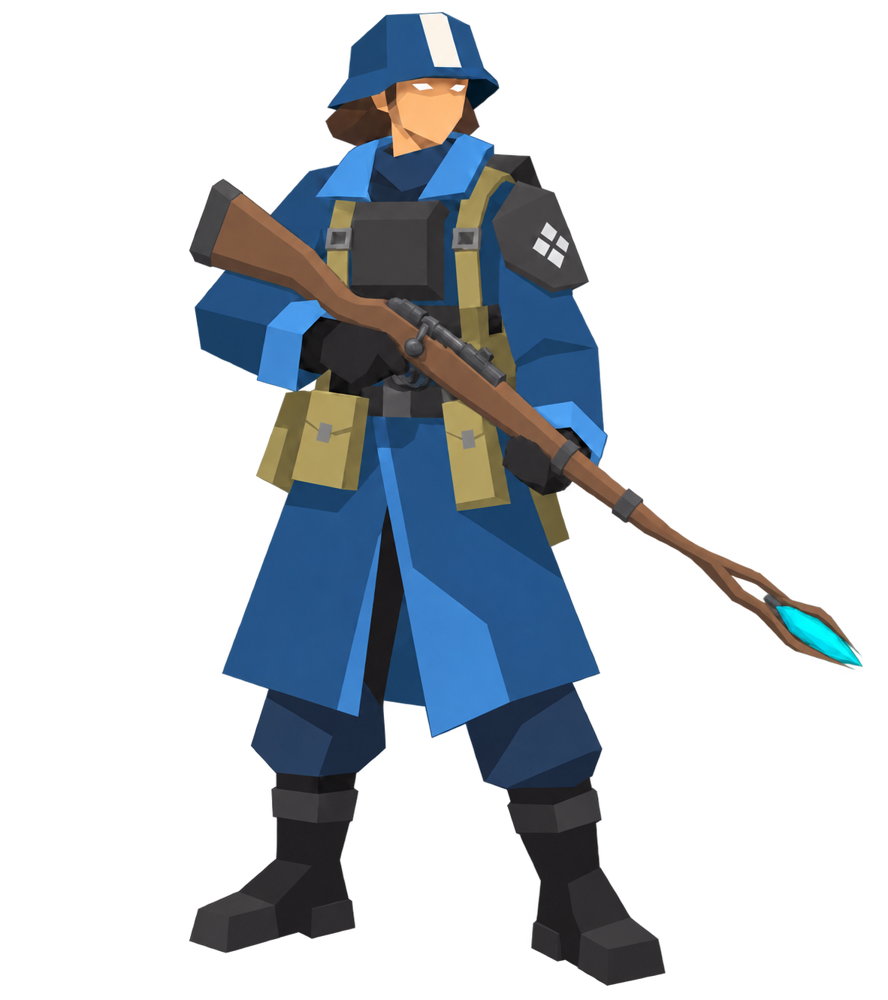
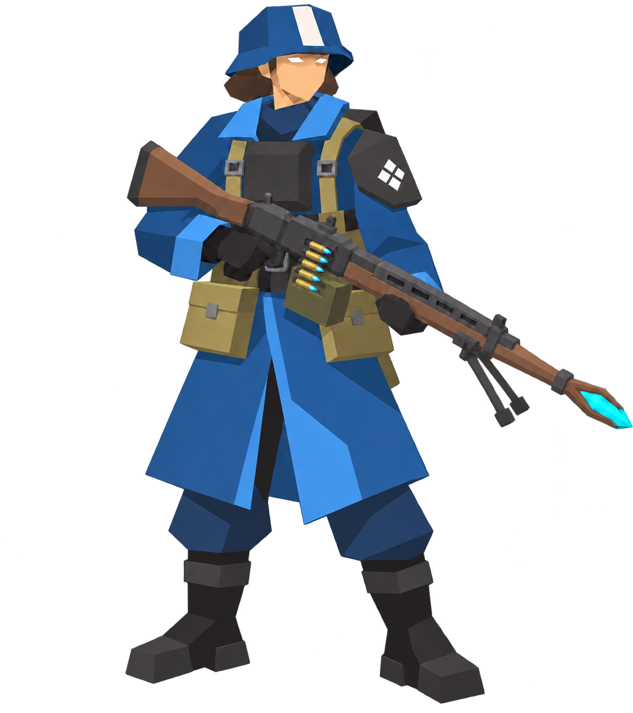

# Initial character concept examples

Selected by Jordan for preservation as the first concept examples on 19 September
2026. These are exploratory character references, not final production models or
a locked art specification.

Both examples depict a female soldier in the same WWII-inspired, low-poly
magic-tech unit: a heavy blue coat, angular steel armour, minimal facial detail,
and a firearm integrated with a wooden staff and cyan crystal tip. Both PNGs have
transparent backgrounds.

## Rifleman

Bolt-action staff rifle with a defined shoulder stock, visible bolt handle, and
the narrowed wooden fork and crystal at the muzzle.

## Machine gunner

Heavier automatic staff-gun with an ammunition box, belt feed, bipod, and brass
cartridge casings with blue arcane projectile tips.

## Provenance

Created and iteratively edited with the built-in OpenAI image generation tool
during the art discussion of 18–19 September 2026. Tactical Breach Wizards was
the user's visual reference; third-party reference images are not included here.
Role names describe the equipment variants. Neither image is a mesh, rig, or
verified multi-view modelling reference.
